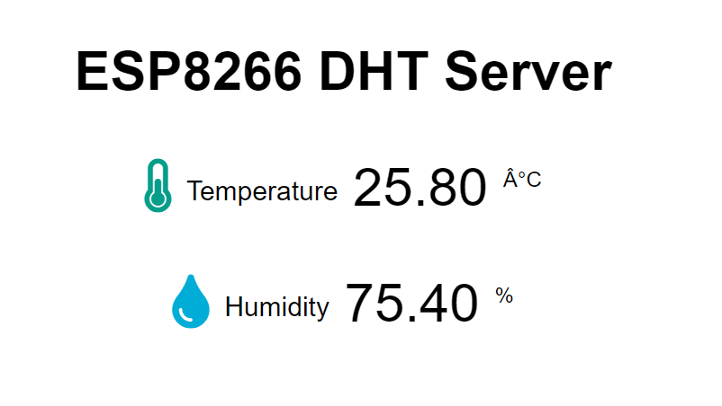

https://gndtovcc.home.blog/2020/04/13/esp8266-dht11-dht22-temperature-and-humidity-web-server-with-arduino-ide/

## Library

ESP8266 Asynchronous Web Server
https://github.com/me-no-dev/ESPAsyncWebServer

ESPAsync TCP Library
https://github.com/me-no-dev/ESPAsyncTCP

## Circuit

// 

## Print Screen

